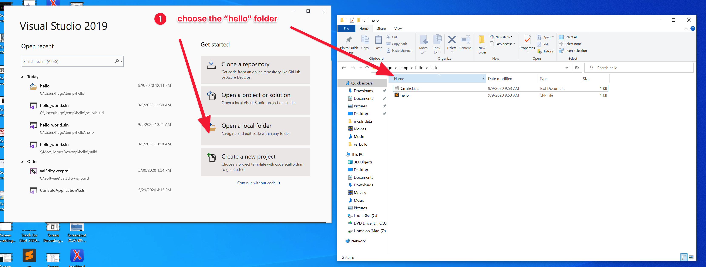
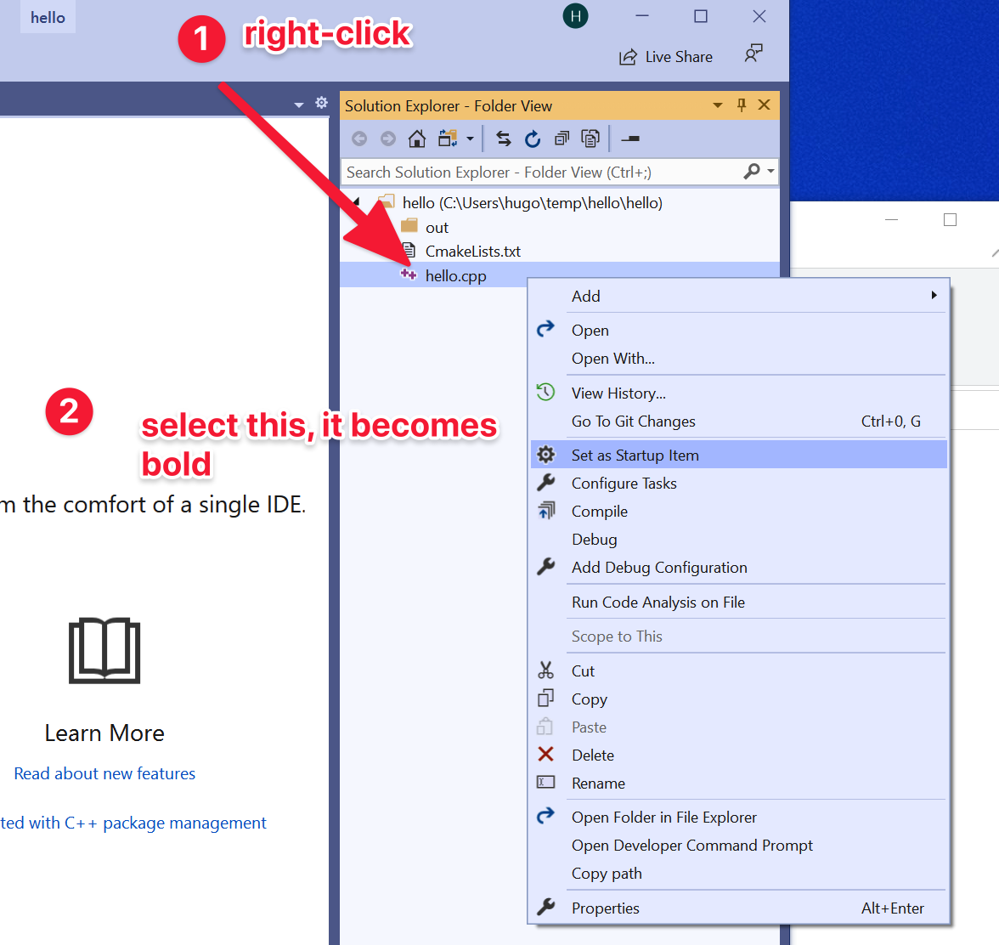
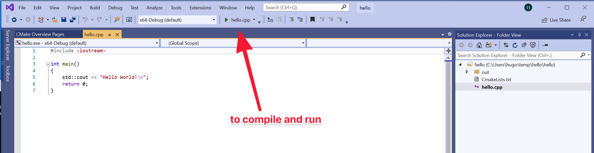
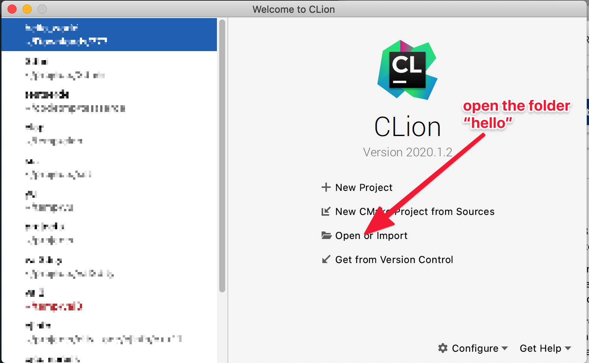
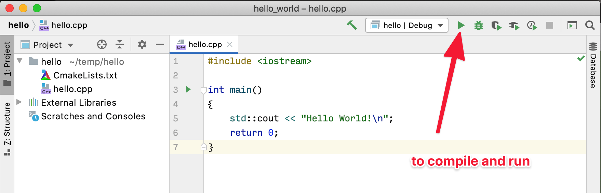

## Installation of compiler + IDE for C++

  > __Note:__ There are usually many options to set up a development environment on each operating system. What proposed here is not the only option, but I try to minimize your effort. Besides, you may skip some of the steps if they have been properly set up already. Or if you know what you're doing, you're allowed to use any C++ you want. As long as you know how to deal with a CMake project, it's good.

Here's a small test project (`hello.zip`) with one C++ unit (hello.cpp) and a CMake file (the project file to tell the compiler how to compile the project).
 
### Windows

Install [Microsoft Visual Studio Community 2019](https://visualstudio.microsoft.com/), and *not* Visual Studio Code.
This comes with the IDE and the C++ compiler.

From Visual Studio, you can do this to open the folder and compile and run.

### macOS   
 
Install the compiler, in the console type: `xcode-select --install` 
Instead, you could just install [XCode](https://developer.apple.com/xcode/), but it's way bigger and XCode itself is not necessary; if you already have XCode installed then you're good no need to do anything.

For the IDE, install [CLion](https://www.jetbrains.com/clion/). It's free for 30days, and as a student you can request a free licence.

CLion allows you to open automatically a CMake project, so just open the folder where you unzip the small project and voilà you're up and running.

### Linux  

Install C/C++ compiler and related tools through a few commands

  - If you are using Fedora, Red Hat, CentOS, or Scientific Linux, etc., use the following yum command:
     
    `yum groupinstall 'Development Tools'`
       
  - If you are using Debian, Ubuntu, and their variants, run the following `apt-get` commands one by one:
     
    `sudo apt-get update`
     
    `sudo apt-get install build-essential manpages-dev`

For the IDE, install [CLion](https://www.jetbrains.com/clion/). It's free for 30days, and as a student you can request a free licence.

To open a project and run, see above, same as macOS.

